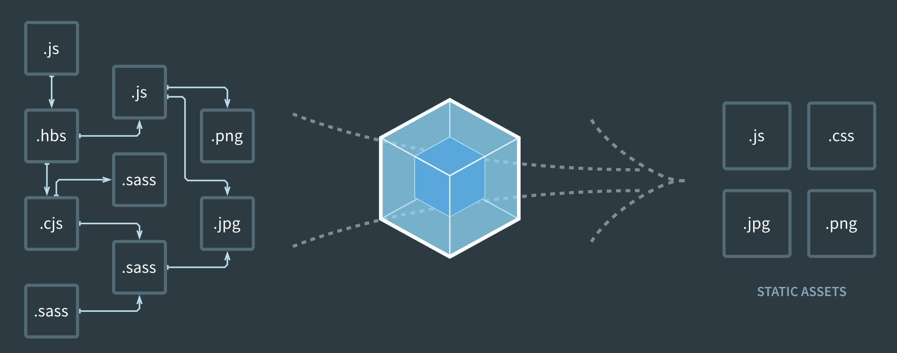

## webpack v4 基础入门

## webpack 的基本概念
webpack 是一个 JS 代码模块化的打包工具，藉由它强大的扩展能力，逐渐成为一个功能完善的构建工具。它会根据代码的内容解析模块依赖，帮助我们把多个模块的代码打包

如上图，webpack 会把我们项目中使用到的多个代码模块（可以是不同文件类型），打包构建成项目运行仅需要的几个静态文件。webpack 有着十分丰富的配置项，提供了十分强大的扩展能力，可以在打包构建的过程中做很多事情。我们先来看一下 webpack 中的几个基本概念。

## 安装和使用

```bash
npm init
npm install webpack webpack-cli
```

## 入口
我们常见的项目中，如果是单页面应用，那么可能入口只有一个；
如果是多个页面的项目，那么经常是一个页面会对应一个构建入口。
入口可以使用 entry 字段来进行配置，webpack 支持配置多个入口来进行构建：
```js

module.exports = {
  entry: './src/index.js' 
}

// 上述配置等同于
module.exports = {
  entry: {
    main: './src/index.js'
  }
}

// 或者配置多个入口
module.exports = {
  entry: {
    foo: './src/page-foo.js',
    bar: './src/page-bar.js', 
    // ...
  }
}

// 使用数组来对多个文件进行打包
// 可以理解为多个文件作为一个入口，webpack 会解析两个文件的依赖后进行打包。
module.exports = {
  entry: {
    main: [
      './src/foo.js',
      './src/bar.js'
    ]
  }
}

```

## loader
webpack 中提供一种处理多种文件格式的机制，便是使用 loader。我们可以把 loader 理解为是一个转换器，负责把某种文件格式的内容转换成 webpack 可以支持打包的模块。

举个例子，在没有添加额外插件的情况下，webpack 会默认把所有依赖打包成 js 文件，如果入口文件依赖一个 .hbs 的模板文件以及一个 .css 的样式文件，那么我们需要 handlebars-loader 来处理 .hbs 文件，需要 css-loader 来处理 .css 文件（这里其实还需要 style-loader，后续详解），最终把不同格式的文件都解析成 js 代码，以便打包后在浏览器中运行。

当我们需要使用不同的 loader 来解析处理不同类型的文件时，我们可以在 module.rules 字段下来配置相关的规则，例如使用 Babel 来处理 .js 文件：

```js
module: {
  // 
  rules: [
    {
      test: /\.jsx?/, // 匹配文件路径的正则表达式，通常我们都是匹配文件类型后缀
      include: [
        path.resolve(__dirname, 'src') // 指定哪些路径下的文件需要经过 loader 处理
      ],
      use: 'babel-loader', // 指定使用的 loader
    }
  ],
}
```
**总结**：loader 是 webpack 中比较复杂的一块内容，它支撑着 webpack 来处理文件的多样性

## plugin
plugin 用于处理更多其他的一些构建任务。
可以这么理解，模块代码转换的工作由 loader 来处理，除此之外的其他任何工作都可以交由 plugin 来完成。
通过添加我们需要的 plugin，可以满足更多构建中特殊的需求。
例如，要使用压缩 JS 代码的 uglifyjs-webpack-plugin 插件，只需在配置中通过 plugins 字段添加新的 plugin 即可
```js
const UglifyPlugin = require('uglifyjs-webpack-plugin')

module.exports = {
  plugins: [
    new UglifyPlugin()
  ],
}
```
除了压缩 JS 代码的 `uglifyjs-webpack-plugin`，常用的还有定义环境变量的 `DefinePlugin，生成` CSS 文件的 `ExtractTextWebpackPlugin` 等

## 输出 output

```js
module.exports = {
  // ...
  output: {
    path: path.resolve(__dirname, 'dist'),
    filename: 'bundle.js',
  },
}

// 或者多个入口生成不同文件
module.exports = {
  entry: {
    foo: './src/foo.js',
    bar: './src/bar.js',
  },
  output: {
    filename: '[name].js',
    path: __dirname + '/dist',
  },
}

// 路径中使用 hash，每次构建时会有一个不同 hash 值，避免发布新版本时线上使用浏览器缓存
module.exports = {
  // ...
  output: {
    filename: '[name].js',
    path: __dirname + '/dist/[hash]',
  },
}
```

## 简单的 webpack 配置

webpack 的配置其实是一个 Node.js 的脚本，这个脚本对外暴露一个配置对象，webpack 通过这个对象来读取相关的一些配置。因为是 Node.js 脚本，所以可玩性非常高，你可以使用任何的 Node.js 模块，如上述用到的 path 模块，当然第三方的模块也可以。
创建了 webpack.config.js 后再执行 webpack 命令，webpack 就会使用这个配置文件的配置了。

## 小结
webpack 的安装和使用和大多数使用 Node.js 开发的命令行工具一样，使用 npm 安装后执行命令即可，webpack 4.x 版本的零配置特性也让上手变得更加简单。

## 搭建基本的前端开发环境

- 构建我们发布需要的 html css js
- 使用 css 预处理器来处理样式
- 处理和压缩图片
- 使用 babel 来支持 es 新特性
- 本地提供静态服务以方便调试

## 关联 HTML
构建时 html-webpack-plugin 会为我们创建一个 HTML 文件，其中会引用构建出来的 JS 文件


## 模块解析规则
webpack 中有一个很关键的模块 enhanced-resolve 就是处理依赖模块路径的解析的，
我们简单整理一下基本的模块解析规则，以便更好地理解后续 webpack 的一些配置会产生的影响。

解析相对路径
查找相对当前模块的路径下是否有对应文件或文件夹
是文件则直接加载
是文件夹则继续查找文件夹下的 `package.json` 文件
有 `package.json` 文件则按照文件中 main 字段的文件名来查找文件
无 `package.json` 或者无 main 字段则查找 `index.js` 文件
解析模块名
查找当前文件目录下，父级目录及以上目录下的 `node_modules` 文件夹，看是否有对应名称的模块
解析绝对路径（不建议使用）
直接查找对应路径的文件
在 `webpack` 配置中，和模块路径解析相关的配置都在 `resolve` 字段下：

```js
module.exports = {
  resolve: {
    // ...
  }
}
```

## 常用的一些配置
我们先从一些简单的需求来阐述 webpack 可以支持哪些解析路径规则的自定义配置。

`resolve.alias`
假设我们有个 utils 模块极其常用，经常编写相对路径很麻烦，希望可以直接 import 'utils' 来引用，那么我们可以配置某个模块的别名，如：

```js
alias: {
  utils: path.resolve(__dirname, 'src/utils') // 这里使用 path.resolve 和 __dirname 来获取绝对路径
}
```

上述的配置是模糊匹配，意味着只要模块路径中携带了 utils 就可以被替换掉，如：

`import 'utils/query.js' // 等同于 import '[项目绝对路径]/src/utils/query.js'`
如果需要进行精确匹配可以使用：

alias: {
  utils$: path.resolve(__dirname, 'src/utils') // 只会匹配 import 'utils'
}

## copy-webpack-plugin
这个插件看名字就知道它有什么作用，没错，就是用来复制文件的。

我们一般会把开发的所有源码和资源文件放在 src/ 目录下，构建的时候产出一个 build/ 目录，通常会直接拿 build 中的所有文件来发布。有些文件没经过 webpack 处理，但是我们希望它们也能出现在 build 目录下，这时就可以使用 CopyWebpackPlugin 来处理了。

我们来看下如何配置这个插件：

```js
const CopyWebpackPlugin = require('copy-webpack-plugin')

module.exports = {
  // ...
  plugins: [
    new CopyWebpackPlugin([
      { from: 'src/file.txt', to: 'build/file.txt', }, // 顾名思义，from 配置来源，to 配置目标路径
      { from: 'src/*.ico', to: 'build/*.ico' }, // 配置项可以使用 glob
      // 可以配置很多项复制规则
    ]),
  ],
}
```

## 开发和生产环境的构建配置差异
当你指定使用 production mode 时，默认会启用各种性能优化的功能，包括构建结果优化以及 webpack 运行性能优化，而如果是 development mode 的话，则会开启 debug 工具，运行时打印详细的错误信息，以及更加快速的增量编译构建...

webpack 4.x 版本引入了 mode 的概念，在运行 webpack 时需要指定使用 production 或 development 两个 mode 其中一个，这个功能也就是我们所需要的运行两套构建环境的能力。

## loader 
loader本质上的实现是一个函数
如何开始着手开发一个 loader
loader 的输入和输出
pitch 函数的作用
loader 函数的上下文
一个好的 loader 是怎么样的
